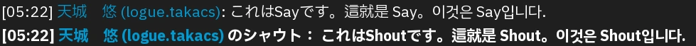

# IBM Plex font for Firestorm and Aperture Viewer

This is a definition file that add the IBM Plex for [Firestorm Viewer](https://www.firestormviewer.org/) and [Aperture Viewer](https://github.com/ApertureViewer/Aperture-Viewer), a third-party viewer for SecondLife, from [IBM Plex](https://github.com/IBM/plex) etc., which contains kanji characters such as Japanese, to the font settings have been improved since [Alchemy Viewer](https://alchemyviewer.org/).

Before:

After:

The current settings use the OS font, which causes the typeface and size to change depending on the environment, making it difficult to read. By using this patch, fonts for all languages ​​will be unified to the IBM Plex font family.

## Install

[Download this repository](https://github.com/logue/firestorm-ibm-plex/archive/refs/heads/master.zip).

Add the following files from this repository to your Firestorm `fonts` directory (`C:\Program Files\Firestorm-Releasex64\fonts` on Windows):

- fonts_ibm_plex.xml
- IBMPlexMath-Regular.ttf
- IBMPlexMono-Regular.ttf
- IBMPlexSansArabic-Bold.ttf
- IBMPlexSansArabic-Regular.ttf
- IBMPlexSans-Bold.ttf
- IBMPlexSans-BoldItalic.ttf
- IBMPlexSansDevanagari-Bold.ttf
- IBMPlexSansDevanagari-Regular.ttf
- IBMPlexSansHebrew-Bold.ttf
- IBMPlexSansHebrew-Regular.ttf
- IBMPlexSans-Italic.ttf
- IBMPlexSansJP-Bold.ttf
- IBMPlexSansJP-Regular.ttf
- IBMPlexSansKR-Bold.ttf
- IBMPlexSansKR-Regular.ttf
- IBMPlexSans-Regular.ttf
- IBMPlexSansSC-Bold.ttf
- IBMPlexSansSC-Regular.ttf
- IBMPlexSansTC-Bold.ttf
- IBMPlexSansTC-Regular.ttf
- IBMPlexSansThai-Bold.ttf
- IBMPlexSansThai-Regular.ttf

Next, start Firestorm and select `IBM Plex` from the UI font settings.

## See Also

- [Firestorm Noto Sans Full](https://github.com/logue/firestorm-noto-sans-cjk)

## License

&copy; 2023,2025 by Logue, Licensed under the GNU LESSER GENERAL PUBLIC LICENSE.

- [IBM Plex font License](./IBMPlexSans-LICENSE.txt)
